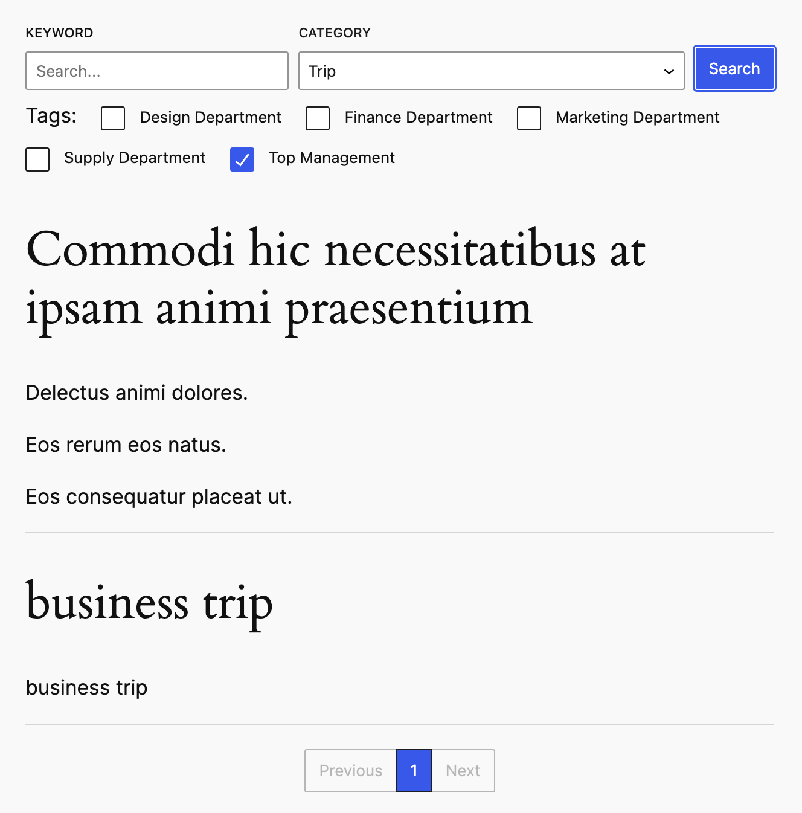

# ITC-Test With WordPress

## Overview
Added a new plugin named "Advanced Search Block". Please install and build this plugin ,and then activate it within the project. Once activated, you can use this search block on pages and posts.

## Plugin Contents


## Installation

Include detailed steps on how to install and activate the plugin.

```sh
# Clone the repository
git clone https://github.com/JaneyWu/ITC-Test.git

# Enter the plugin directory
cd yourproject/wp-content/plugin/advanced-search-block

# Install dependencies
npm install

# build the plugin
npm run build

# activate within the project
```

## Configuration

```js
    For example: https://domain.com/search?q=Test&cat=2&tags[]=1&tags[]=2
    in the edit page, we need change the URL as like `search`
```

## Contact

    Email: janey88wu@gamil.com